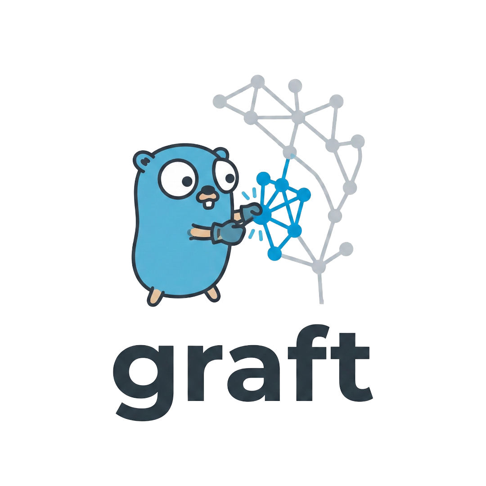

<p align="center">
  
</p>

<p align="center">
  <a href="https://pkg.go.dev/github.com/grindlemire/graft"></a>
  <a href="https://goreportcard.com/report/github.com/grindlemire/graft"></a>
  <a href="https://opensource.org/licenses/MIT"></a>
  <a href="./examples"></a>
</p>

Graph-based dependency execution for Go. Nodes declare dependencies explicitly; the engine executes them in topological order with automatic parallelization.

## Why?

Traditional DI frameworks rely on reflection or code generation. This library provides a simpler approach: nodes register themselves and declare what they depend on. Dependencies "just show up" without magic.

## Features

- **Type-safe nodes** — Generic `Node[T]` with compile-time type checking
- **Declarative dependencies** — Nodes specify what they need, not how to get it
- **Automatic parallelization** — Independent nodes run concurrently
- **Subgraph execution** — Run only specific nodes and their transitive dependencies
- **Node-level caching** — Cache expensive nodes across executions
- **Static analysis** — Validate dependency declarations at test time

## Install

```bash
go get github.com/grindlemire/graft
```

## Usage

### Define Nodes

Each node is typically its own package with an `init()` that registers it:

```go
// nodes/config/config.go
package config

import (
    "context"
    "github.com/grindlemire/graft"
)

const ID graft.ID = "config"

type Output struct {
    DBHost string
    Port   int
}

func init() {
    graft.Register(graft.Node[Output]{
        ID:        ID,
        DependsOn: []graft.ID{}, // root node
        Run:       run,
    })
}

func run(ctx context.Context) (Output, error) {
    return Output{DBHost: "localhost", Port: 5432}, nil
}
```

Nodes access dependencies via `graft.Dep[T]`:

```go
// nodes/db/db.go
package db

import (
    "context"
    "github.com/grindlemire/graft"
    "myapp/nodes/config"
)

const ID graft.ID = "db"

type Output struct {
    Pool *sql.DB
}

func init() {
    graft.Register(graft.Node[Output]{
        ID:        ID,
        DependsOn: []graft.ID{config.ID},
        Run:       run,
    })
}

func run(ctx context.Context) (Output, error) {
    cfg, err := graft.Dep[config.Output](ctx, config.ID)
    if err != nil {
        return Output{}, err
    }
    pool, err := sql.Open("postgres", fmt.Sprintf("host=%s port=%d", cfg.DBHost, cfg.Port))
    if err != nil {
        return Output{}, err
    }
    return Output{Pool: pool}, nil
}
```

### Execute the Graph

Import node packages for side-effect registration, then execute:

```go
package main

import (
    "context"
    "log"

    "github.com/grindlemire/graft"
    _ "myapp/nodes/config"
    _ "myapp/nodes/db"
    _ "myapp/nodes/api"
)

func main() {
    results, err := graft.Execute(context.Background())
    if err != nil {
        log.Fatal(err)
    }
    db := results["db"].(*sql.DB)
    // use db...
}
```

### Subgraph Execution

Run a specific node and its transitive dependencies with type-safe results:

```go
// Only executes "api" and whatever it depends on
// Returns typed result directly, plus full results map for accessing dependencies
api, results, err := graft.ExecuteFor[api.Output](ctx)
if err != nil {
    log.Fatal(err)
}
// api is already typed as api.Output
// results map available for accessing other node outputs if needed
config, _ := graft.Result[config.Output](results, config.ID)
```

### Caching

Mark nodes as cacheable to avoid re-execution across calls:

```go
graft.Register(graft.Node[Output]{
    ID:        ID,
    DependsOn: []graft.ID{},
    Run:       run,
    Cacheable: true, // output cached after first execution
})
```

By default, a global in-memory cache is used. Options for control:

```go
// Use a custom cache
results, _ := graft.Execute(ctx, graft.WithCache(myCache))

// Force re-execution of specific nodes
results, _ := graft.Execute(ctx, graft.IgnoreCache("config"))

// Disable caching entirely
results, _ := graft.Execute(ctx, graft.DisableCache())
```

## Dependency Validation

Static analysis catches dependency mismatches at test time:

```go
func TestNodeDependencies(t *testing.T) {
    graft.AssertDepsValid(t, ".")
}
```

Catches:

- Using `Dep[T](ctx, "x")` without declaring `"x"` in `DependsOn`
- Declaring a dependency that's never used

## License

MIT
