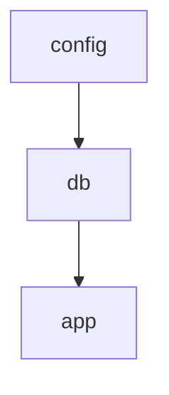

<p align="center">
  
</p>

<p align="center">
  <a href="https://pkg.go.dev/github.com/grindlemire/graft"></a>
  <a href="https://github.com/grindlemire/graft/actions/workflows/ci.yml"></a>
  <a href="https://coveralls.io/github/grindlemire/graft?branch=main"></a>
  <a href="https://goreportcard.com/report/github.com/grindlemire/graft"></a>
  <a href="https://opensource.org/licenses/MIT"></a>
  <a href="./examples"></a>
</p>

Lightweight dependency injection for Go. Just declare what each component needs and the engine handles execution order and parallelization.

## Why graft?

Go's larger DI frameworks rely on reflection or heavy codegen. Graft takes a simpler approach: define nodes in their own packages, register them via `init()`, and let the engine figure out the rest. No reflection or code generation.

## Features

- **Type-safe nodes** — Generic `Node[T]` with compile-time type checking
- **Declarative dependencies** — Nodes specify what they need, not how to get it
- **Automatic parallelization** — Independent nodes run concurrently
- **Subgraph execution** — Run only specific nodes and their transitive dependencies
- **Node-level caching** — Cache expensive nodes across executions
- **Static analysis** — Validate dependency declarations at test time

## Install

```bash
go get github.com/grindlemire/graft
```

## Usage

### Define Nodes

Each node lives in its own package with an `init()` that registers it:

```go
// nodes/config/config.go
package config

import (
    "context"
    "github.com/grindlemire/graft"
)

const ID graft.ID = "config"

type Output struct {
    DBHost string
    Port   int
}

func init() {
    graft.Register(graft.Node[Output]{
        ID:        ID,
        DependsOn: []graft.ID{},
        Run:       run,
    })
}

func run(ctx context.Context) (Output, error) {
    return Output{DBHost: "localhost", Port: 8080}, nil
}
```

Nodes declare dependencies and access them via `graft.Dep[T]`:

```go
// nodes/db/db.go
package db

const ID graft.ID = "db"

type Output struct{ Pool *sql.DB }

func init() {
    graft.Register(graft.Node[Output]{
        ID:        ID,
        DependsOn: []graft.ID{config.ID},
        Run:       run,
        Cacheable: true,
    })
}

func run(ctx context.Context) (Output, error) {
    cfg, err := graft.Dep[config.Output](ctx)
    if err != nil {
        return Output{}, err
    }
    pool, err := sql.Open("postgres", fmt.Sprintf("host=%s port=%d", cfg.DBHost, cfg.Port))
    if err != nil {
        return Output{}, err
    }
    return Output{Pool: pool}, nil
}
```

### Execute the Graph

Import node packages for side-effect registration, then execute:

```go
package main

import (
    "context"
    "log"
    "github.com/grindlemire/graft"
    _ "myapp/nodes/config"
    _ "myapp/nodes/db"
)

func main() {
    results, err := graft.Execute(context.Background())
    if err != nil {
        log.Fatal(err)
    }
    db := results["db"].(*sql.DB)
}
```

### Subgraph Execution

Run only a specific node and its transitive dependencies:

```go
api, results, err := graft.ExecuteFor[api.Output](ctx)
if err != nil {
    log.Fatal(err)
}
// api is typed as api.Output; results map available for other node outputs
config, err := graft.Result[config.Output](results)
```

### Caching

Mark nodes as cacheable to skip re-execution:

```go
graft.Register(graft.Node[Output]{
    ID:        ID,
    DependsOn: []graft.ID{},
    Run:       run,
    Cacheable: true,
})
```

Cache options:

```go
graft.Execute(ctx, graft.WithCache(myCache))    // custom cache
graft.Execute(ctx, graft.IgnoreCache("config")) // force re-run specific nodes
graft.Execute(ctx, graft.DisableCache())        // disable caching entirely
```

## Dependency Validation

Static analysis catches dependency mismatches at test time:

```go
func TestNodeDependencies(t *testing.T) {
    graft.AssertDepsValid(t, ".")
}
```

This catches using `Dep[T](ctx)` without declaring the dependency, or declaring unused dependencies.

## Visualizing the Graph

### ASCII Diagram

```go
graft.PrintGraph(os.Stdout)
```

Output for `config → db → app`:

```text
                                   ┌────────┐
                                   │ config │
                                   └────────┘
                                       ┌┘
                                       │
                                       ▼
                                    ┌────┐
                                    │ db │
                                    └────┘
                                       │
                                       │
                                       ▼
                                    ┌─────┐
                                    │ app │
                                    └─────┘
```

### Mermaid Diagram

```go
graft.PrintMermaid(os.Stdout)
```



Cacheable nodes are marked with `*` (ASCII) or styled with light blue fill (Mermaid).

## License

MIT
