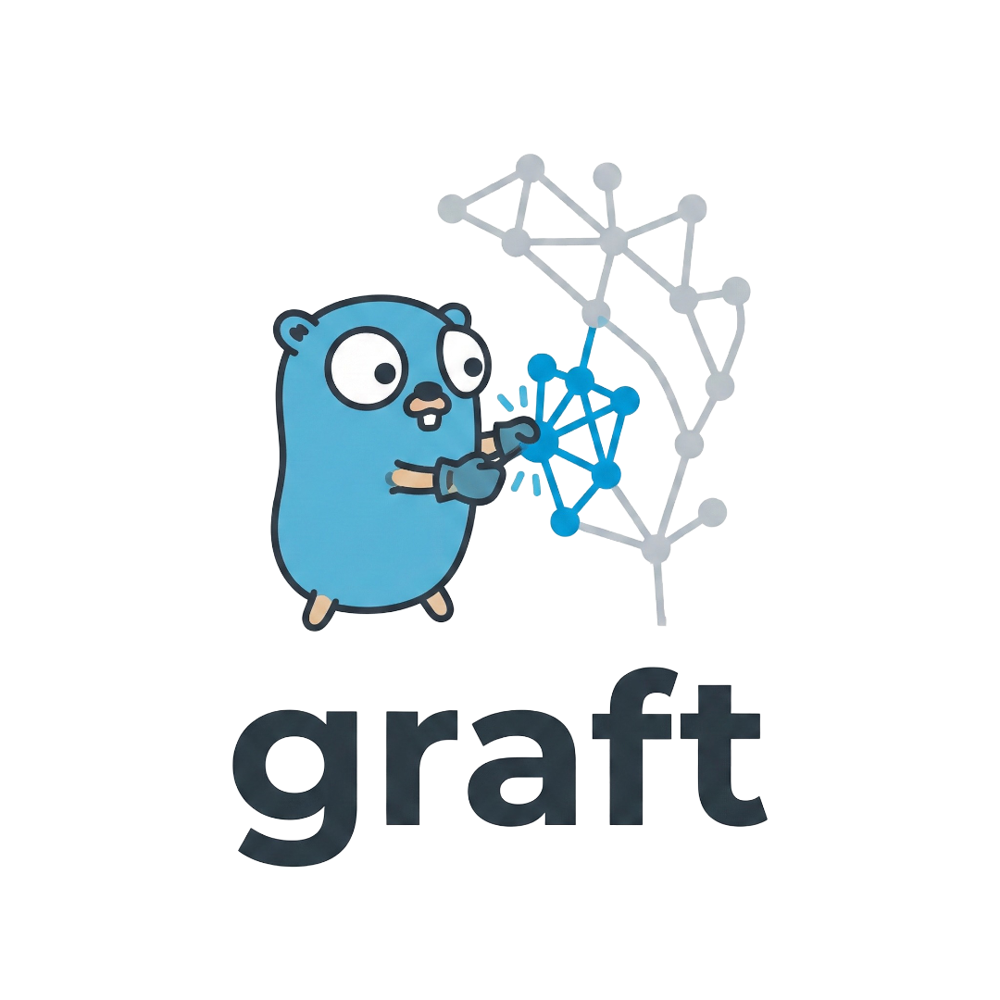

<p align="center">
  
</p>

<p align="center">
  <a href="https://pkg.go.dev/github.com/grindlemire/graft"></a>
  <a href="https://github.com/grindlemire/graft/actions/workflows/ci.yml"></a>
  <a href="https://coveralls.io/github/grindlemire/graft?branch=main"></a>
  <a href="https://goreportcard.com/report/github.com/grindlemire/graft"></a>
  <a href="https://opensource.org/licenses/MIT"></a>
  <a href="./examples"></a>
</p>

Lightweight, type-safe dependency injection and execution graphs for Go.

```text
Example Graph:
                                    ┌───────┐
                              ┌────▶│ cache │────┐
                              │     └───────┘    │
┌────────┐    ┌─────────┐     │                  │     ┌────────┐
│ config │───▶│ secrets │─────┤                  ├────▶│ server │
└────────┘    └─────────┘     │                  │     └────────┘
                              │     ┌────┐       │
                              └────▶│ db │───────┘
                                    └────┘
```

Define each unit of work as a node with a typed output and a list of dependencies. Graft assembles the graph, runs independent nodes in parallel, cancels on the first error, and hands typed values to consumers. Generics do the work that other libraries do with reflection or codegen, and `main()` stays clean instead of stacking twenty `New...` calls in a careful order.

Graft is built for the case Wire and Fx don't address: services where multiple teams write into the same binary, and where the wiring itself has become the integration surface. Read the long-form pitch in [Wiring Go at scale](https://www.alethi.dev/posts/graft-typed-task-graph).

## Why Graft?

- **A real boundary between teams** - A node is a package owned by one team. Other teams only see the typed `Output`. Nothing shared by reaching into a context struct, nothing passed by threading channels through five packages.
- **Independent ownership** - A team can swap their database, add caching, or rewrite their `Run` function without coordinating, as long as the output type stays the same.
- **Free fan-out** - Independent nodes run concurrently because the topology says they can. No hand-rolled `errgroup` blocks accumulating in handlers.
- **Per-execution caching** - Mark a node `Cacheable` and it computes once per execution and feeds every downstream consumer. Replaces ad-hoc `sync.Once` ladders.
- **Runs more than once** - Use the same model for the long-lived application graph at startup *and* the per-request execution graph (`ExecuteFor[T]` runs a subgraph for the value you actually need).
- **Compile-time and CI enforcement** - Cycles fail to compile. Missing dependencies fail in CI via [`AssertDepsValid`](#validation).

## Install

```bash
go get github.com/grindlemire/graft
```

Full API documentation: [pkg.go.dev/github.com/grindlemire/graft](https://pkg.go.dev/github.com/grindlemire/graft)

## Usage

### 1. Define Nodes

Create a package for your node and register it in `init()`.

```go
// nodes/db/db.go
package db

import (
    "context"
    "github.com/grindlemire/graft"
    "myapp/nodes/config"
)

// the ID for this node
const ID graft.ID = "db"

// what type you want to output from this node for others to consume
type Output struct { Pool *sql.DB }

func init() {
    // register our node with graft for our output type
    graft.Register(graft.Node[Output]{
        ID:        ID,
        // list any dependencies here (any cycles won't let you import it)
        DependsOn: []graft.ID{config.ID},
        Run:       run,
    })
}

// run gets executed by graft to produce our output from our dependencies
func run(ctx context.Context) (Output, error) {
    // Type-safe dependency injection
    cfg, err := graft.Dep[config.Output](ctx)
    if err != nil {
        return Output{}, err
    }

    return Output{Pool: connect(cfg)}, nil
}
```

### 2. Execute

Import your nodes for side-effects and run the engine.

```go
package main

import (
    "github.com/grindlemire/graft"
    // import our nodes to register them
    _ "myapp/nodes/config"
    _ "myapp/nodes/db"
)

func main() {
    // Run a specific subgraph
    // Returns the typed output of the target node
    db, results, err := graft.ExecuteFor[db.Output](ctx)
    if err != nil {
         // handle error
    }

    // OR run the entire graph
    // results, err := graft.Execute(ctx)
}
```

### Caching

Skip expensive calculations by marking nodes as cacheable.

```go
graft.Register(graft.Node[Output]{
    // ...
    Cacheable: true,
})
```

Control cache behavior at runtime:

```go
graft.Execute(ctx, graft.WithCache(customCache))
graft.Execute(ctx, graft.IgnoreCache(config.ID))
```

### Validation

Catch missing or unused dependencies during tests.

```go
func TestDeps(t *testing.T) {
    graft.AssertDepsValid(t, ".")
}
```

Options for more detail:

```go
// Verbose output - shows each node's declared and used dependencies
graft.AssertDepsValid(t, ".", graft.WithVerboseTesting())

// Debug output - shows AST-level tracing for troubleshooting
graft.AssertDepsValid(t, ".", graft.WithDebugTesting())
```

For programmatic access (CI integration, custom reporting):

```go
results, err := graft.CheckDepsValid("./nodes")
for _, r := range results {
    if r.HasIssues() {
        // r.Undeclared - deps used but not declared
        // r.Unused - deps declared but not used
    }
}
```

#### Compile Time Graph Checking

Place each node in its own package and Go's import rules enforce a valid graph for you:

- **No cycles** - To depend on node `B`, node `A` must import `B`'s package. Circular imports don't compile.
- **No missing deps** - Referencing `config.ID` in your `DependsOn` requires importing the config package. If it doesn't exist, the build fails.

See the [examples](./examples) directory for this pattern.

### Visualization

Generate diagrams directly from your code for better visibility in large code bases

```go
// Print ASCII graph to stdout
graft.PrintGraph(os.Stdout)

// Generate Mermaid syntax
graft.PrintMermaid(os.Stdout)
```

## Why not Wire or Fx?

There is real overlap. You can register your database, logger, and config as `Cacheable` nodes, call `graft.Execute` once at startup, and graft does what most teams reach for Wire or Fx for. Each library makes different tradeoffs.

### [Wire](https://github.com/google/wire)

Wire generates a wiring file at build time with no runtime overhead.

- No longer maintained (archived 2025-08-25)
- Requires running `wire` before each build
- Provider sets and injector functions are extra concepts to learn before writing a node
- Built for one application graph composed once; not per-request execution

Graft uses plain Go `init()` functions and generics. No extra build step and no generated files. If you specifically want zero-runtime-cost wiring, Wire still has a better story for that.

### [Fx](https://github.com/uber-go/fx)

Fx wires dependencies at runtime with reflection and ships an explicit lifecycle model.

- Errors surface at runtime, not compile time
- Reflection obscures stack traces and makes debugging harder
- `fx.Invoke` / `fx.Lifecycle` add boilerplate for most use cases

Graft resolves the graph at execution time but uses generics for type safety; type mismatches and cycles fail at compile time. If you specifically want managed start/stop lifecycle hooks and ordered graceful shutdown, Fx has a better story for that.

### What graft does that DI containers don't

Both Wire and Fx assume the graph runs once, at startup. Graft is built to run the graph repeatedly with different inputs:

- **`ExecuteFor[T]`** - run only the subgraph required to produce `T`. Useful for handlers that pull a slice of the full graph, CLIs with many subcommands, and reports that read a subset of metrics.
- **`Cacheable` nodes** - shared once per execution across every consumer.
- **Automatic parallelism** - independent nodes in the per-request graph run concurrently with no errgroup written by hand.

Services often need both shapes: a long-lived application graph and a per-request execution graph. Graft holds both in the same model.

### What graft is not

Graft is not a workflow engine. The graph describes a single in-process execution. State doesn't survive crashes and work can't span machines. For long-running work across machines, reach for Temporal or similar.

### When to use Graft

The argument is strongest when one of these is true:

- Multiple teams contribute to the same binary and the wiring is becoming the integration surface.
- The request or batch path has enough independent work that hand-rolled errgroups are accumulating.
- There are enough optional outputs that subgraph execution starts to matter (handlers with conditional fields, CLIs with many subcommands).
- Multiple consumers compute the same intermediate value and ad-hoc caches are appearing.
- The wiring across packages is bad enough that the org is reaching for Wire, Fx, or some other DI system to manage it.

Graft works fine on a small service too: registration is one extra line per node compared to writing a constructor, and you still get concurrency, per-execution caching, and typed boundaries between packages. The value compounds with team count.

## License

MIT
